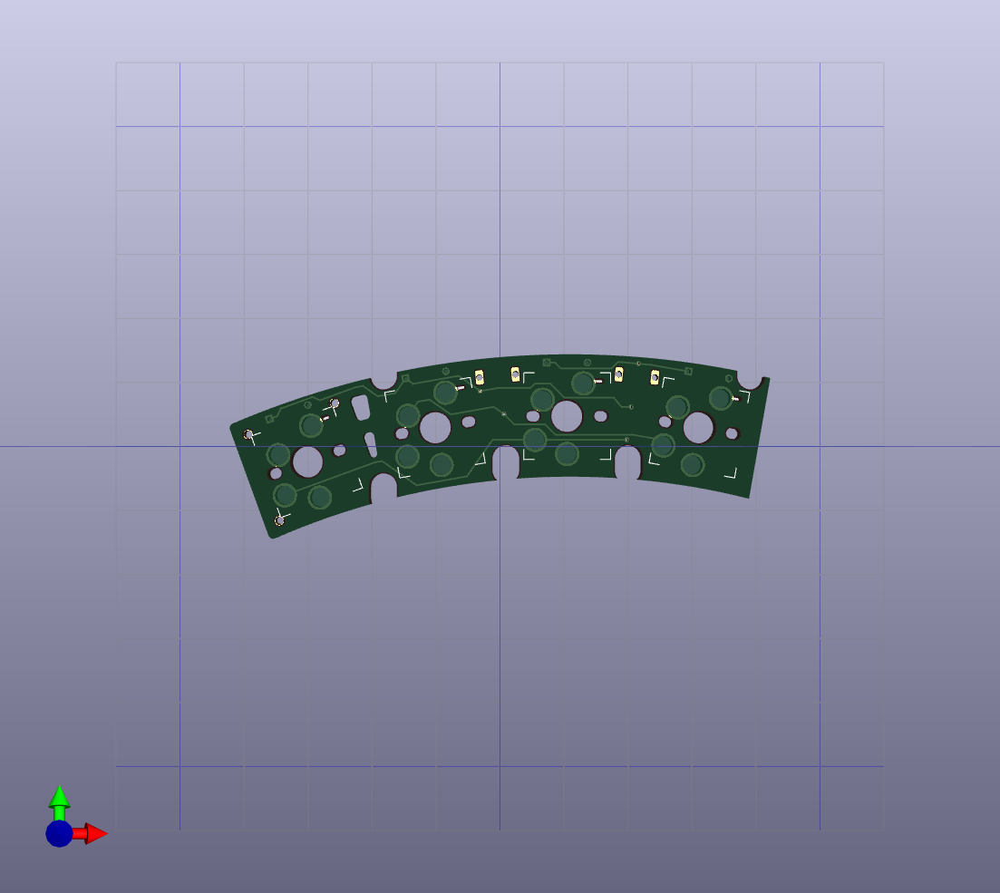

2023/02/05
MIT LICENSE

# Pangaea RI 1.2 Extension
This is a version of the Pangaea RI 1.2 thumb modules

## 4-key rightmost key deleted (right most key cut)

This is a version of the Pangaea RI 1.2 thumb module with the rightmost key deleted.

The original thumb module can be made to 4-key version by cutting each of the three PCBs, but this is not only time-consuming but also potentially injurious.

|  Parts  |  Picture  |
| ---- | ---- |
| Top Plate |   |
| PCB |  |
| Bottom Plate |  |

*Note: SH connector can be used only for the left side, connector with x mark won't work.

## 4-key rightmost key deleted (leftt most key cut)

This is a version of the Pangaea RI 1.2 thumb module with the leftmost key deleted.

### Changes

The changes are basically just removing the rightmost key from the standard PCB. And for the leftmost standoff on the PCB, the space has been filled in to support the PCB from below. The PCB can now be supported using M1.4 size screws.

## 8-key thumb module with arrow keys

8-key thumb moudule with arrow keys. (test sample)

|  Parts  |  Picture  |
| ---- | ---- |
| Top Plate |   |

## History
* 2023/02/18 External shape changed to the same state as when it was cut cleanly; Top, PCB and Bottom size match confirmed.
* 2023/10/16 thumb8-arrowkey module added.
